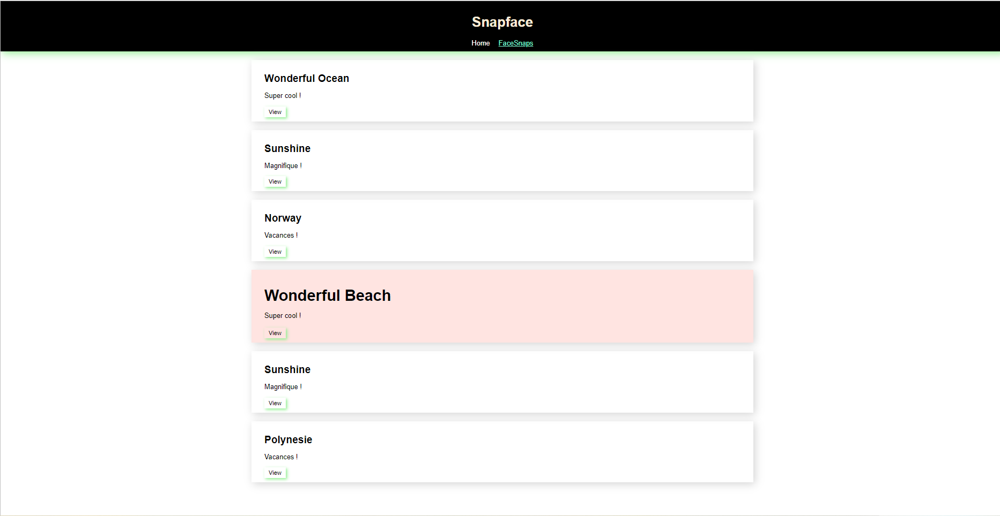
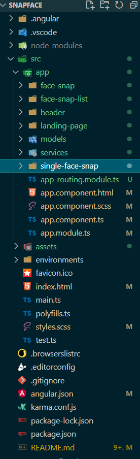

# Projet Snapface ✌️

# L'application snapFace 📸 avec [Angular](https://angular.io/docs)

## Table of Contents
1. [General Info](#general-info)
2. [Technologies](#technologies)
3. [Installation](#installation) 
5. [Project Directory](#project-directory) 
6. [Angular application](#angular-application)


# General Info 🀄


>Application photo - projet réalisé suite au nouveau cours 
>Angular OpenClassrooms 👌

# Technologies
* Système d'exploitation: Windows 11
* [Node Js](https://nodejs.org/en/download/): Version 16.14.2 
* [Angular](https://angular.io/docs): Version 13.2.6

# Installation
* git clone https://github.com/ioanamatac/snapFace.git
* cd../path/to/the/file
* npm install
* ng serve

# Project Directory

# Angular Application 

>Installer le CLI d'Angular(Command Line Interface, ou interface en ligne de commande) :
* npm i -g @angular/cli
>Creation projet :
* ng new snapface --style=scss --skip-tests=true
>Lancer le serveur de développement sur http://localhost:4200 : 
* ng serve
>Creation d'un component:
* ng generate component nom component
>Creation d'un service :
>pour injecter un service dans un component, ajoutez un argument au constructor du component qui a le type du service, par exemple private userService: UserService

>Creation d'une landing page :
>« En marketing digital, une landing page est une page web distincte, créée spécifiquement pour les besoins d’une campagne de marketing ou de publicité. C’est sur cette page qu’un visiteur atterrit après avoir cliqué sur une publicité, un bouton d’appel à l’action ou autre. »[Unbounce](https://unbounce.com/landing-page-articles/what-is-a-landing-page/)

>L'affichage de l'heure en francais par default :

>Dans app.module.ts :
```JavaScript import { LOCALE_ID, NgModule } from '@angular/core';
import { BrowserModule } from '@angular/platform-browser';

import { AppComponent } from './app.component';
import { FaceSnapComponent } from './face-snap/face-snap.component';
import { registerLocaleData } from '@angular/common';
import * as fr from '@angular/common/locales/fr';

@NgModule({
  declarations: [
    AppComponent,
    FaceSnapComponent
  ],
  imports: [
    BrowserModule
  ],
  providers: [
    { provide: LOCALE_ID, useValue: 'fr-FR'}
  ],
  bootstrap: [AppComponent]
})
export class AppModule {
  constructor() {
    registerLocaleData(fr.default);
  }
}

```
>Creation d'un header 👇 like usual :
* ng g c header
>L'affichage des donnees dans les templates, formater la valeur sans modifier la donnée, elle-même  :
* l'utilisation des pipes : DatePipe, DecimalPipe, PercentPipe et CurrencyPipe

>Enjoy !👋
Ioana
